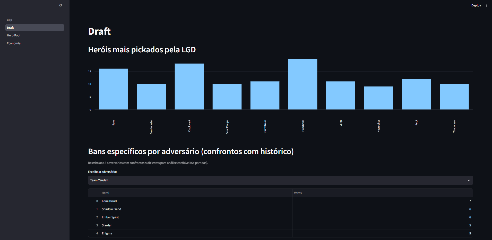
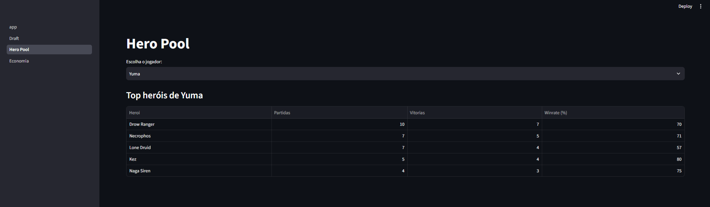
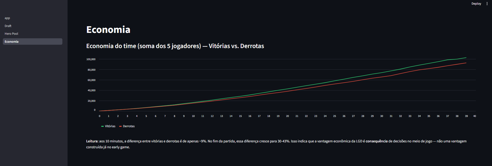

# 🎮 Dota 2 Scouting — LGD Gaming

[](https://python.org)
[](https://streamlit.io)
[](https://sqlite.org)

Pipeline completo de análise competitiva de Dota 2, construído do zero como
projeto de aprendizado prático em engenharia e análise de dados — da coleta
via API até um scout report profissional com recomendações acionáveis.

> Este projeto foi construído seguindo um processo estruturado, orientado por
> mentoria, simulando o fluxo de trabalho de um analista de dados júnior em
> uma organização de esports Tier 1: planejamento → coleta → armazenamento →
> ETL → análise exploratória → estatísticas → padrões → visualização →
> dashboard → relatório final.

## 📋 Sobre o projeto

O objetivo foi produzir um relatório de scouting real sobre a LGD Gaming
(roster sul-americano atual, formado em maio/2026), respondendo perguntas
que um coach profissional faria: como o time costuma vencer, quais são seus
heróis de conforto, como drafta, como se comporta na economia e nos
objetivos do jogo.

Mais do que o relatório em si, o foco do projeto foi desenvolver **raciocínio
analítico** — aprender a formular hipóteses, validar (ou descartar) padrões
com evidência, reconhecer limitações de amostra pequena, e não confundir
correlação com causalidade.

## 🔍 Principais descobertas

- **A vantagem econômica da LGD é consequência, não causa**: a diferença de
  recursos entre vitórias e derrotas é pequena aos 10 minutos (~9%) e cresce
  para 30-43% até o final da partida — evidência de que o time vence por
  decisões de meio de jogo, não por pressão early.
- **Hero pool concentrado**: Hoodwink (Thiolicor, 17 partidas, 71% winrate) e
  Bane (KJ, 16 partidas, 69% winrate) são as combinações mais consistentes
  do roster.
- **Huskar/TaiLung** confirmado como ameaça através de evidência cruzada —
  100% winrate em 4 partidas *e* o herói mais banido contra a LGD pela cena
  competitiva (53x).
- **Bans direcionados por adversário**: cruzando confrontos repetidos contra
  o mesmo time, foi possível isolar bans específicos (ex: Enchantress banida
  em 100% dos confrontos contra o PlayTime) de bans que refletem apenas meta
  geral do patch.

📄 **Relatório completo:** [`reports/scout_report_lgd.md`](reports/scout_report_lgd.md)

## 🛠️ Stack técnica

| Camada | Ferramenta |
|---|---|
| Coleta de dados | Python, `requests`, OpenDota API |
| Armazenamento | SQLite |
| Transformação/ETL | Python, SQL |
| Análise | SQL, Pandas |
| Visualização | Matplotlib |
| Dashboard | Streamlit |
| Versionamento | Git / GitHub |

## 📁 Estrutura do projeto

data/
├── raw/ # dados brutos coletados da API (não versionado)
│ └── match_details/ # detalhes completos de cada partida
└── processed/
└── lgd_scouting.db # banco SQLite com dados estruturados
src/
├── collectors/ # scripts de coleta via OpenDota API
├── etl/ # criação de tabelas e carga no banco
├── analysis/ # análise exploratória, estatísticas e gráficos
└── dashboards/
├── app.py # página inicial do dashboard
└── pages/ # páginas: Draft, Hero Pool, Economia
reports/
├── scout_report_lgd.md # relatório final
└── *.png # gráficos exportados


## ⚙️ Como rodar

**Requisitos:** Python 3.9+

```bash
# 1. Criar e ativar ambiente virtual
python -m venv .venv
.venv\Scripts\Activate.ps1   # Windows

# 2. Instalar dependências (versões exatas em requirements.txt)
pip install -r requirements.txt

# 3. Rodar os scripts de coleta (src/collectors/) e ETL (src/etl/), na ordem,
#    para popular o banco de dados local

# 4. Abrir o dashboard interativo
streamlit run src/dashboards/app.py
```

**O que você vai ver no dashboard:**
- **Draft**: heróis mais pickados pelo time e bans específicos por adversário
- **Hero Pool**: heróis de maior confiança por jogador, com winrate e amostra
- **Economia**: curva de ouro do time ao longo do jogo, vitórias vs. derrotas

## 📸 Screenshots





## 🗄️ Modelagem do banco de dados

| Tabela | Conteúdo |
|---|---|
| `partidas` | Resumo de cada partida: resultado, placar, duração, adversário |
| `jogadores_partida` | Herói, KDA, GPM/XPM por jogador da LGD por partida |
| `picks_bans` | Cada evento de pick/ban do draft, com time responsável |
| `herois` | Tabela de referência (ID → nome) |
| `economia_10min` | Snapshot de ouro/XP aos 10 minutos, por jogador |
| `roshan_kills` | Eventos de morte de Roshan, com time responsável |
| `wards_por_jogador` | Total de observer wards por jogador por partida |

## 📈 O que este projeto me ensinou

Este foi meu primeiro projeto construído literalmente do zero — incluindo
conceitos básicos de sistema de arquivos, terminal e ambiente virtual.
Ao longo do processo, desenvolvi:

- **Coleta de dados via API**: requisições HTTP, tratamento de status code,
  rate limiting, coleta incremental com checkpoint (retomável sem duplicar
  trabalho)
- **Modelagem de banco de dados relacional**: normalização, chaves primárias
  simples e compostas, joins entre múltiplas tabelas
- **ETL e qualidade de dados**: tratamento de encoding, validação de
  consistência, detecção de outliers reais vs. dado corrompido
- **Análise exploratória com disciplina metodológica**: diferenciar hipótese
  de conclusão, evitar conclusões de amostra pequena, separar causa de
  consequência, isolar sinal de ruído (ex: distinguir meta do patch de
  estratégia específica de time)
- **Visualização orientada a pergunta**: cada gráfico do projeto responde
  uma pergunta específica, evitando gráfico por estética
- **Dashboards interativos** com Streamlit, incluindo consultas SQL
  parametrizadas via interface
- **Versionamento com Git/GitHub**, incluindo fluxo completo de
  init → commit → remote → push

## 🔮 Próximos passos

- [ ] Parametrizar o pipeline para permitir scouting de qualquer time (hoje
      específico para a LGD)
- [ ] Aprofundar análise de distribuição de timing de Roshan (não só média)
- [ ] Extrair localização de wards para análise de controle de mapa
- [ ] Deploy do dashboard (Streamlit Community Cloud)

## 👤 Autor

Fabio Igor
[LinkedIn](https://linkedin.com/in/fabio-oliveira-693523146) · [GitHub](https://github.com/fabio-igor)